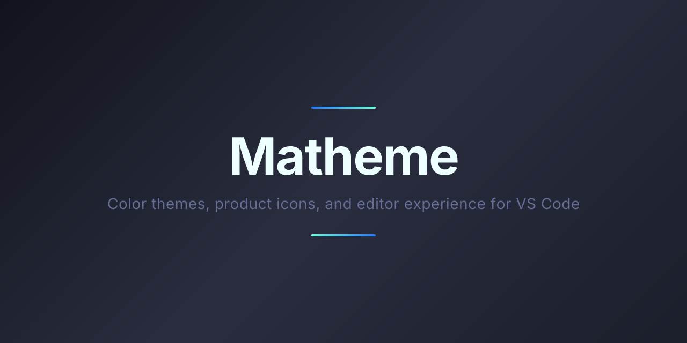

<p align="center">
  
</p>

# Matheme

A Material-inspired color theme, product icon theme, and editor experience for VS Code.

## Themes

- **Community Material Theme** — Default, Darker, Palenight, Ocean, Lighter (+ High Contrast variants)
- **Material Theme** — Deepforest, Midnight, Rosewood (+ High Contrast variants)

## Product Icons

Matheme includes a custom product icon theme with 457 curated icons from Phosphor, Carbon, and Material Symbols. Activate it via `Preferences: Product Icon Theme` and select **Matheme Product Icons**.

## Installation

Launch *Quick Open* (`Ctrl+P` / `⌘P`) and paste:

```shell
ext install cdbattags.matheme
```

## Activate theme

Open the command palette (`Ctrl+Shift+P` / `⌘+Shift+P`), type `theme`, choose `Preferences: Color Theme`, and select a Matheme variant.

## Set the accent color

Open the command palette, type `matheme`, and choose `Matheme: Set accent color`.

## Override theme colors

Customize any color via VS Code's `workbench.colorCustomizations` and `editor.tokenColorCustomizations` settings. See the [VS Code docs](https://code.visualstudio.com/docs/getstarted/themes#_customizing-a-color-theme).

## Attribution

Originally inspired by [Material Theme for VS Code](https://github.com/material-theme/vsc-material-theme) (Apache 2.0).
